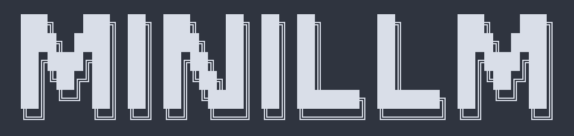

# minillm



`minillm` is a small Zig CLI for talking to your Ollama models with Nord-inspired ANSI colors.

It keeps the first version simple:
- `minillm` opens interactive chat
- `minillm ask "..."` sends a one-shot prompt
- `minillm models` lists available models
- `minillm modes` lists available modes
- `minillm --mode careful|verify|selfcheck ...` adds anti-hallucination behaviors
- uses local `ollama` if installed
- otherwise falls back to your Mac mini over SSH

## How It Works

`minillm` is just the client, not the model.

- Your MacBook runs the Zig CLI and handles the terminal UI.
- If `ollama` exists locally, `minillm` talks to it directly.
- If local `ollama` is missing, `minillm` SSHes into your Mac mini and runs Ollama there.
- The Mac mini does the actual inference.
- The response is streamed back to your MacBook terminal.

So the split is:

- MacBook Pro: CLI, prompt input, output formatting
- Mac mini: model execution through Ollama

## Launch

```sh
minillm
minillm ask "Explain tangent spaces simply."
minillm models
minillm modes
minillm --mode careful ask "What corpora has this model been trained on?"
minillm --mode verify ask "What corpora has this model been trained on?"
minillm --mode selfcheck ask "What corpora has this model been trained on?"
minillm --model jj-code ask "Write a zsh one-liner to list PDFs."
```

Interactive mode also supports:

- `:q`
- `:models` or `models`
- `:modes` or `modes`
- `:mode normal` or `mode normal`
- `:mode careful` or `mode careful`
- `:mode verify` or `mode verify`
- `:mode selfcheck` or `mode selfcheck`
- `normal`, `careful`, `verify`, or `selfcheck` by themselves also switch modes

Interactive chat keeps a short rolling transcript, so follow-up clarifications like "I'm talking about the Mac mini model" are grounded in the previous turn instead of being treated as a brand new standalone request.

## Anti-Hallucination Modes

- `normal`
  - plain answer generation
- `careful`
  - abstention-first prompting
  - if the answer depends on local state with no trusted evidence, it should say `I don't know`
- `verify`
  - draft -> verification questions -> independent checks -> final revision
  - based on the verification-pass style used in Chain-of-Verification work
- `selfcheck`
  - generates multiple independent answer attempts and then keeps only stable shared facts
  - if the samples disagree, it should abstain

These modes reduce hallucinations probabilistically. They do not replace grounding or direct tool access for machine-specific facts.
`minillm` now also injects the active selected model and configured Mac mini fallback host into prompts so references like `this model` or `the Mac mini llm` resolve more consistently.

## Defaults

- model: `jj-general`
- SSH fallback host: `user@example-host`
- remote ollama path: `/Applications/Ollama.app/Contents/Resources/ollama`

Override with env vars:

```sh
export MINILLM_MODEL=jj-code
export MINILLM_REMOTE_HOST=user@example-host
export MINILLM_REMOTE_OLLAMA=/Applications/Ollama.app/Contents/Resources/ollama
export MINILLM_MODEL_FACTS_DIR=$HOME/.config/minillm/model-facts
```

## Notes

- `minillm` is written in Zig.
- The default remote model is `jj-general`.
- Set `MINILLM_REMOTE_HOST` locally to your actual Mac mini host.
- The SSH fallback path shell-quotes prompts correctly, so apostrophes in questions work.
- For local machine-state questions, the best long-term fix is still explicit commands or grounded local context, not prompt-only control.
- For model provenance or training-corpus questions, `minillm` can load trusted per-model notes from `MINILLM_MODEL_FACTS_DIR/<model>.md`.
- If no external notes are configured, `minillm` falls back to a small built-in facts block for `jj-general` and `jj-code`.
